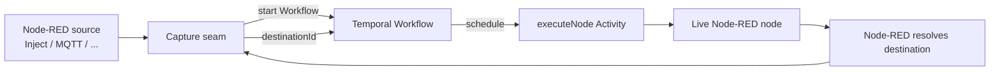

# node-red-temporal

[](https://github.com/tbrandenburg/node-red-temporal/actions/workflows/tests.yml)


[](LICENSE)

**Temporal-backed durable execution for Node-RED flows using unmodified Node-RED nodes and routing.**

> [!IMPORTANT]
> **This is not the official Node-RED repository or distribution.**
> `node-red-temporal` is an independent experimental fork of [node-red/node-red](https://github.com/node-red/node-red), built to explore running Node-RED flows with [Temporal](https://temporal.io/) as the durable execution scheduler.
>
> Looking for standard Node-RED? Start at [nodered.org](https://nodered.org/) or [node-red/node-red](https://github.com/node-red/node-red).

> [!WARNING]
> **Early alpha.** The core execution model and a representative compatibility corpus are working, but this project is not yet tuned or recommended for production workloads. See [Known limitations](#known-limitations).

Keep the Node-RED things that already work well:

- the Node-RED flow format;
- real Node-RED node implementations and config nodes;
- credentials and context stores;
- source connections such as Inject and MQTT;
- Node-RED's own route resolution, including Link, Catch, Complete and nested subflows;
- Node-RED's normal flow deployment lifecycle.

Use Temporal for the part that benefits from durable orchestration:

- durable workflow progress and history;
- downstream node scheduling;
- Activity retries;
- branch/fan-in scheduling;
- recovery when Workflow or Activity workers restart.

The design rule is simple:

> **Node-RED decides where a message should go. Temporal decides when that destination runs.**

## Quick start

### Prerequisites

- Node.js **>= 22.9**
- the [Temporal CLI](https://docs.temporal.io/cli) available on your `PATH`
- `make` for the convenience lifecycle commands below

Clone and install:

```bash
git clone https://github.com/tbrandenburg/node-red-temporal.git
cd node-red-temporal
npm install
```

Start the Temporal dev server, a Temporal-backed runner, and an ordinary
Node-RED editor:

```bash
make run
```

This boots with **no pre-baked flow** - build/edit a flow in the editor at
`http://localhost:1880` and press **Deploy**; it ships to the runner and
executes durably on Temporal. Open the Temporal Web UI to watch it:

```text
http://localhost:8233
```

To seed the runner's initial flow instead of starting empty, pass `FLOW=`
(e.g. one of the package's `demo/flows*.json` fixtures):

```bash
make run FLOW=packages/node_modules/@tbrandenburg/node-red-temporal-runtime/demo/flows.json
```

Check or stop the lifecycle:

```bash
make status
make stop
```

For the full CLI, split-worker deployment, MQTT gate, recovery demo, and serialization behavior, see the [runtime package README](packages/node_modules/@tbrandenburg/node-red-temporal-runtime/README.md).

## Docker quick start

Prefer a container over installing Node.js/Temporal locally? Run the whole
stack (Postgres, Temporal, Temporal UI, and a `dev` container running editor
A + runner B) with Docker Compose:

```bash
make docker-run
```

Then open:

- Node-RED editor: http://localhost:1880
- Temporal UI: http://localhost:8233

Build or import a normal Node-RED flow and press **Deploy** - it ships to the
runner and executes durably on Temporal, exactly like the non-Docker path.

Useful commands:

```bash
make docker-status   # compose + editor/runner state
make docker-logs      # follow dev + temporal logs
make docker-shell     # shell into the dev container
make docker-stop      # stop everything (volumes/state preserved)
```

### Use an existing Temporal server

```bash
TEMPORAL_ADDRESS=host.docker.internal:17233 \
TEMPORAL_NAMESPACE=default \
make docker-run-external
```

This starts only the `dev` container against the given `TEMPORAL_ADDRESS`;
the local Postgres/Temporal/Temporal UI services are never started or
stopped by this command, and `make docker-stop` never touches an externally
managed Temporal server.

### Running `temporal` CLI commands against the Docker stack

The `temporal` CLI binary already lives inside the running `temporal`
service container (the same binary its healthcheck uses), so the simplest
way to run ad-hoc CLI commands against the local stack is `docker compose
exec` into that container, targeting its own IP rather than the `temporal`
DNS alias:

```bash
docker compose exec temporal sh -lc 'temporal operator cluster health --address "$(hostname -i):7233"'
docker compose exec temporal sh -lc 'temporal operator namespace list --address "$(hostname -i):7233"'
docker compose exec temporal sh -lc 'temporal workflow list --address "$(hostname -i):7233" --namespace default'
```

A separate `temporal-tools` (`temporalio/admin-tools`) container used to be
offered for this, but it doesn't work: the bundled CLI reliably times out
("failed reaching server: context deadline exceeded") when addressed via the
Compose DNS alias `temporal:7233` from a different container, even though
the same address works fine for the Node.js Temporal SDK client used by
runner B. This is a known upstream limitation (see
[temporalio/docker-compose#234](https://github.com/temporalio/docker-compose/issues/234)),
not something specific to this repo, so the `temporal-tools` service has
been removed rather than worked around.

## How it works



The integration uses Node-RED's public runtime hooks. When a live node sends a message, Node-RED performs its normal routing first. The Capture layer records the resolved destination and suppresses that external local hop. Temporal then schedules the destination as the next Activity.

There is no parallel routing engine trying to reinterpret Node-RED flow JSON.

### Ownership boundary

| Node-RED owns | Temporal owns |
| --- | --- |
| Node and config-node lifecycle | Durable downstream scheduling |
| Node registry and node implementations | Workflow progress/history |
| Credentials | Activity retries |
| Context/storage | Worker-restart recovery |
| Source connections and timers | Branch scheduling |
| Route resolution | Execution ordering across captured hops |
| Flow deploy/redeploy lifecycle | Durable orchestration state |

## What works today

The current alpha supports, among other things:

- autonomous source ingress;
- fan-out and multiple outputs;
- repeated sends on the same port;
- Link routing;
- Catch and Complete routing;
- Join/fan-in;
- nested subflows;
- finite loops with a runaway execution guard;
- credentials and shared config nodes;
- node, flow and global context;
- configurable persistent context stores;
- flow redeploy without process restart;
- explicit `flowVersion` protection for in-flight Workflows;
- combined or split Workflow/Activity worker processes;
- configurable Temporal address, namespace and task queues;
- worker restart/recovery.

See [COMPATIBILITY.md](packages/node_modules/@tbrandenburg/node-red-temporal-runtime/COMPATIBILITY.md) for the exact evidence behind these statements.

### HTTP compatibility

- ✅ **Outbound `http request` nodes** are supported as ordinary Node-RED
  Activities, subject to the documented at-least-once side-effect semantics.
- ❌ **Inbound `http in → ... → http response` flows** are currently
  unsupported. Those nodes depend on live `req`/`res` connection objects
  that cannot cross Temporal's durable message boundary or survive a worker
  restart.

The early alpha targets message-driven flows with serializable messages.
Durable HTTP ingress may be designed separately later rather than pretending
an open HTTP connection is durable.

## Compatibility evidence

The published early-alpha smoke matrix deliberately stays small rather than pretending to cover the entire Node-RED ecosystem.

Current measured corpus:

| Corpus | Result |
| --- | ---: |
| Node/runtime mechanisms | **8/8 PASS** |
| Flow patterns | **10/10 PASS** |
| Manual/external gates | **2/2 PASS** |
| `@tbrandenburg` unit suite recorded with the matrix | **156/156 passing** |

These numbers describe **only the published corpus**. They are not a claim that a corresponding percentage of all Node-RED nodes or community flows is supported.

Read the full matrix and limitations in [COMPATIBILITY.md](packages/node_modules/@tbrandenburg/node-red-temporal-runtime/COMPATIBILITY.md).

## Deployment modes

For local development, one process can host both Temporal roles:

```text
node-red-temporal
├── Node-RED runtime + Activity Worker
└── Workflow Worker
```

For separate deployments:

```text
Workflow Worker
      │
      ▼
   Temporal
      ▲
      │
Node-RED runtime + Activity Worker
```

Only the Activity role boots Node-RED and owns source ingress. The Workflow role is deterministic and does not load Node-RED.

See the [runtime package README](packages/node_modules/@tbrandenburg/node-red-temporal-runtime/README.md) for commands and configuration.

## Existing Node-RED editor

The primary local UX uses an ordinary Node-RED editor as design time and a
separate node-red-temporal runner as execution time:

```text
existing Node-RED editor
        │ normal Deploy
        ▼
node-red-temporal runner
        │
        ▼
     Temporal
```

`make run` wires this setup together locally: an ordinary editor (A) whose
normal Deploy button ships flows to a separate runner (B), which serves the
Admin API with its own editor disabled.

For an existing Node-RED installation, install
`@tbrandenburg/node-red-temporal-runtime` into the editor's userDir,
configure the remote-deploy storage adapter, and point it at runner B. See
the [runtime package README](packages/node_modules/@tbrandenburg/node-red-temporal-runtime/README.md#use-an-existing-node-red-editor-with-a-temporal-runtime-issue-39)
for the exact `settings.js` sequence, `credentialSecret` requirement, runner
setup, and revert instructions.

## Known limitations

This is an early alpha. Important boundaries are explicit:

- **Activities are at-least-once.** Killing a worker mid-Activity can repeat a side effect such as an already-issued HTTP request.
- **In-flight flow migration is not implemented.** Redeploying to a new `flowVersion` causes Workflows pinned to the old version to fail explicitly with `FLOW_VERSION_MISMATCH`.
- **Context durability is a Node-RED storage concern.** The default in-memory context is still lost on restart; configure a persistent Node-RED context store when required.
- **Not every JavaScript object is a durable message.** Circular objects, functions and live sockets/streams cannot safely cross the Temporal serialization boundary. Buffer/Date/Error behavior is documented in the runtime package README.
- **Inbound `HTTP In → HTTP Response` bridging is not implemented.** Those live `req`/`res` objects are outside the current durable message boundary; outbound `http request` is unaffected and supported (see [HTTP compatibility](#http-compatibility)).
- **Hooks are process-global.** Run one Capture instance per Node-RED Activity-worker process.
- **Legacy (pre-1.0) `on('input', function(msg))` node handlers fail fast, not silently.** Nodes that never receive/call a `done()` callback cannot be tracked for completion by Node-RED itself, so their Activity now fails immediately with an explicit `LEGACY_NODE_NO_DONE` error instead of hanging for the full node-execution timeout; see the runtime package's [`COMPATIBILITY.md`](packages/node_modules/@tbrandenburg/node-red-temporal-runtime/COMPATIBILITY.md#legacy-pre-10-input-handler-nodes-issue-53-resolution).
- **Performance is not yet characterized.** No production throughput, batching or autoscaling guidance is claimed.

For the detailed serialization table and recovery semantics, see the [runtime package README](packages/node_modules/@tbrandenburg/node-red-temporal-runtime/README.md).

## Repository map

| Path | Purpose |
| --- | --- |
| [`packages/node_modules/@tbrandenburg/node-red-temporal-runtime/`](packages/node_modules/@tbrandenburg/node-red-temporal-runtime/) | Temporal-backed Node-RED runtime integration |
| [runtime README](packages/node_modules/@tbrandenburg/node-red-temporal-runtime/README.md) | Detailed architecture, CLI and operational documentation |
| [COMPATIBILITY.md](packages/node_modules/@tbrandenburg/node-red-temporal-runtime/COMPATIBILITY.md) | Small published compatibility smoke matrix |
| [AGENTS.md](AGENTS.md) | Architecture rules and protected upstream boundaries |
| [UPSTREAM.md](UPSTREAM.md) | Fork point and upstream-sync audit trail |

## Upstream relationship

This repository is a divergent fork of [node-red/node-red](https://github.com/node-red/node-red), originally forked from Node-RED **5.0.7**.

The Temporal integration lives under:

```text
packages/node_modules/@tbrandenburg/node-red-temporal-runtime/
```

The upstream Node-RED runtime, registry, nodes and editor packages remain protected from project-specific modification. The execution seam uses Node-RED's existing public hook API rather than maintaining a private fork of its routing internals.

See [UPSTREAM.md](UPSTREAM.md) for the exact fork/sync policy.

## Development

Install dependencies and run the repository test suite:

```bash
npm install
npm test
```

Run the faster core suite:

```bash
npm run mocha:core
```

Before accepting runtime changes, the protected upstream source paths must remain unchanged:

```bash
git diff --stat upstream/main -- \
  packages/node_modules/@node-red/ \
  packages/node_modules/node-red/
```

That command should produce no output.

Project-specific implementation and tests belong under the `@tbrandenburg` package/test trees. Read [AGENTS.md](AGENTS.md) before contributing.

## Contributing

Issues and pull requests for **node-red-temporal** belong in this repository:

- [Issues](https://github.com/tbrandenburg/node-red-temporal/issues)
- [Pull requests](https://github.com/tbrandenburg/node-red-temporal/pulls)

Do not open node-red-temporal pull requests against the upstream `node-red/node-red` repository.

For standard Node-RED bugs, usage questions or contributions unrelated to this Temporal integration, use the official [Node-RED project](https://github.com/node-red/node-red) and [Node-RED documentation](https://nodered.org/docs/).

## License and acknowledgements

This fork remains licensed under the [Apache License 2.0](LICENSE).

[Node-RED](https://nodered.org/) is an OpenJS Foundation project and provides the runtime, editor, flow format and node ecosystem this work builds on.

[Temporal](https://temporal.io/) provides the durable execution platform used for Workflow and Activity scheduling.

**node-red-temporal is an independent experimental project and is not the official repository for Node-RED or Temporal.**
