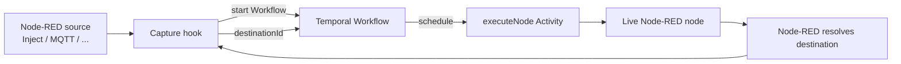

# @tbrandenburg/node-red-temporal-runtime

[](https://www.npmjs.com/package/@tbrandenburg/node-red-temporal-runtime)
[](https://nodejs.org/)
[](https://temporal.io/)
[](../../../../LICENSE)

Run an ordinary Node-RED flow as a durable [Temporal](https://temporal.io/)
Workflow without replacing Node-RED's nodes, flow format, or route resolution.

> [!WARNING]
> This package is early alpha software. It is an execution experiment, not a
> production-ready Node-RED distribution. Read [Known limitations](#known-limitations)
> before using it for side effects.

## Why this exists

Node-RED is excellent at describing and running message flows. Temporal is
excellent at making long-running work durable. This runtime joins those two
strengths at the message-delivery boundary:

```text
Node-RED resolves the destination.
Temporal decides when that destination runs.
```

The runtime boots a real, headless Node-RED process. A public Node-RED hook
captures each externally routed `send()`, records the destination Node-RED
already resolved, and suppresses the local hop. Temporal then schedules the
next node as an Activity.

## Quick start

### Requirements

- Node.js `>=22.9`
- A running Temporal server, such as the [Temporal CLI dev server](https://docs.temporal.io/cli)
- A Node-RED flow exported as `flows.json`

From the repository, the fastest path is:

```bash
npm install
make demo-run
make demo-start
```

The demo starts a Temporal dev server and a worker for the included flow. Open
the Temporal Web UI at <http://localhost:8233> to inspect the Workflow and its
Activity history.

Stop the demo with:

```bash
make demo-stop
```

### Run a flow directly

Start a Temporal dev server in one terminal:

```bash
temporal server start-dev
```

Start the combined worker in another:

```bash
node bin/node-red-temporal --flow demo/flows.json
```

The scheduled Inject in the demo starts Workflow Executions automatically.
For an explicit one-off start, use:

```bash
node bin/node-red-temporal start \
  --flow demo/flows.json \
  --start-node n1 \
  --input '{"payload":"hello"}'
```

## Installation

When installing the public npm package:

```bash
npm install @tbrandenburg/node-red-temporal-runtime
```

The repository also contains the package at
`packages/node_modules/@tbrandenburg/node-red-temporal-runtime/` for local
development. The repository's root `npm install` provides the pinned Node-RED
and Temporal dependencies used by the test suite.

## How it works



### Ownership boundary

| Node-RED owns | Temporal owns |
| --- | --- |
| Node and config-node lifecycle | Durable downstream scheduling |
| Node registry and implementations | Workflow progress and history |
| Credentials and context/storage | Activity retries |
| Source connections and timers | Worker-restart recovery |
| Route resolution | Durable execution ordering |
| Flow deploy/redeploy lifecycle | Orchestration state |

Node-RED's resolved routing is authoritative. The runtime does not rebuild a
second routing engine from raw wires. A minimal wire graph exists only as a
fallback for callers that provide a message without a captured destination.

## Worker roles

The CLI supports one combined process or two independently deployed roles.

### Combined worker

The default mode boots Node-RED, installs Capture, owns source ingress, and
polls both Workflow and Activity tasks:

```bash
node bin/node-red-temporal --flow demo/flows.json
```

### Split workers

The Workflow worker is deterministic and never boots Node-RED. The Activity
worker owns the live Node-RED runtime and source ingress:

```bash
# Workflow role
node bin/node-red-temporal worker --role workflow \
  --workflow-task-queue node-red-temporal-workflow

# Activity role
node bin/node-red-temporal worker --role activity \
  --flow demo/flows.json \
  --activity-task-queue node-red-temporal-workflow
```

Both roles accept the same Temporal connection settings. Use CLI flags or the
corresponding environment variables:

| Setting | CLI flag | Environment variable | Default |
| --- | --- | --- | --- |
| Temporal address | `--address` | `TEMPORAL_ADDRESS` | `127.0.0.1:7233` |
| Namespace | `--namespace` | `TEMPORAL_NAMESPACE` | `default` |
| Workflow task queue | `--workflow-task-queue` | `TEMPORAL_WORKFLOW_TASK_QUEUE` | `node-red-temporal` |
| Activity task queue | `--activity-task-queue` | `TEMPORAL_ACTIVITY_TASK_QUEUE` | `node-red-temporal` |

## What works today

The tested early-alpha corpus includes:

- autonomous source ingress;
- fan-out, multiple outputs, and repeated sends;
- Link, Catch, and Complete routing;
- Join/fan-in and finite loops;
- nested subflows;
- credentials, config nodes, and Node-RED context;
- configurable persistent context stores;
- flow redeploy without restarting the worker;
- explicit `flowVersion` protection for in-flight Workflows;
- combined and split Workflow/Activity workers;
- worker restart and Workflow recovery.

See [`COMPATIBILITY.md`](COMPATIBILITY.md) for the measured matrix and its
scope. The matrix is evidence for a small representative corpus, not a claim
that every Node-RED node or community flow is supported.

## Known limitations

These are behavioral boundaries, not configuration options:

- **Activities are at-least-once.** A worker killed during a side-effecting
  Activity can execute that Activity again. The recovery demo is intentionally
  killed between Activities, not during one.
- **Flow versions do not migrate.** A redeploy changes the content-hash
  `flowVersion`; an in-flight Workflow pinned to the old version fails with
  `FLOW_VERSION_MISMATCH`.
- **Context is not Temporal state.** In-memory Node-RED context is lost on a
  worker restart. Configure a persistent Node-RED context store when required.
- **Hooks are process-global.** Run one Capture instance per Activity-worker
  process.
- **HTTP request/response objects are not durable messages.** `http in` and
  `http response` bridging is not implemented.
- **Throughput is uncharacterized.** There is no production sizing, batching,
  autoscaling, or latency guidance yet.

## Message serialization boundary

Messages crossing a Workflow or Activity boundary use Temporal's default data
converter. The runtime does not normalize messages before conversion.

| Value | Result |
| --- | --- |
| Strings, numbers, booleans, `null` | Supported unchanged |
| Plain objects and arrays | Supported with JSON semantics |
| `Buffer` | Bytes preserved, decoded as `Uint8Array` rather than `Buffer` |
| `Date` | Decoded as an ISO-8601 string |
| `undefined` | Supported; object properties with `undefined` are dropped |
| `Error` | Decoded as `{}`; non-enumerable error fields are lost |
| Functions | Bare functions fail; function-valued properties are dropped |
| Circular objects | Conversion fails with a Temporal `ValueError` |
| Sockets and streams | Not durable; only an inert enumerable snapshot may remain |

Treat live handles, request objects, streams, and circular structures as
outside the durable message boundary.

## Package map

| Module | Responsibility |
| --- | --- |
| `lib/bootstrap.js` | Boots Node-RED and computes the content-hash `flowVersion` |
| `lib/capture.js` | Captures resolved routes and completion/error events |
| `lib/activities.js` | Delivers one message to one live node |
| `lib/workflows.js` | Deterministically drains captured destinations |
| `lib/worker.js` | Creates combined, Workflow, and Activity workers |
| `lib/wireGraph.js` | Fallback `nodeId -> wires` transform |
| `bin/node-red-temporal` | Worker and explicit Workflow-start CLI |

## Development

From the repository root:

```bash
npm install
npm run mocha:core
npm test
```

Runtime tests live under
`test/unit/@tbrandenburg/node-red-temporal-runtime/`. The implementation is
kept under the `@tbrandenburg` package tree so the upstream Node-RED packages
remain unchanged.

To publish the runtime package:

```bash
make publish
```

To create a GitHub release for the runtime package:

```bash
make release BUMP=PATCH
```

The release target creates a `temporal-v<version>` tag and GitHub release. It
requires a clean worktree and does not publish to npm automatically.

## Project links

- [Project overview and design](../../../../README.md)
- [Compatibility matrix](COMPATIBILITY.md)
- [GitHub releases](https://github.com/tbrandenburg/node-red-temporal/releases)
- [Issue tracker](https://github.com/tbrandenburg/node-red-temporal/issues)
- [Temporal documentation](https://docs.temporal.io/)
- [Node-RED documentation](https://nodered.org/docs/)

## License

Apache-2.0. See [`LICENSE`](../../../../LICENSE).
