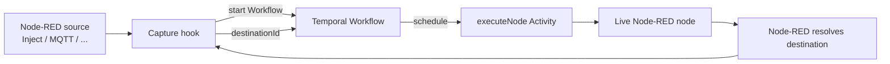
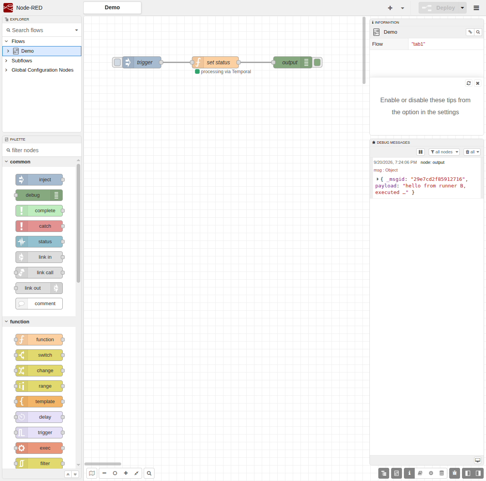
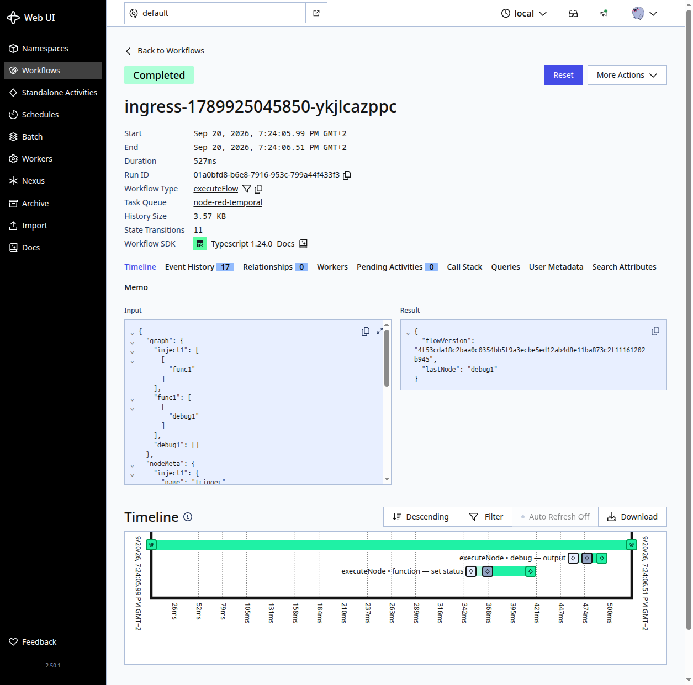

# @tbrandenburg/node-red-temporal-runtime

[](https://www.npmjs.com/package/@tbrandenburg/node-red-temporal-runtime)
[](https://nodejs.org/)
[](https://temporal.io/)
[](../../../../LICENSE)

Run an ordinary Node-RED flow as a durable [Temporal](https://temporal.io/)
Workflow without replacing Node-RED's nodes, flow format, or route resolution.

> [!WARNING]
> This package is early alpha software. It is an execution experiment, not a
> production-ready Node-RED distribution. Read [Known limitations](#known-limitations)
> before using it for side effects.

## Why this exists

Node-RED is excellent at describing and running message flows. Temporal is
excellent at making long-running work durable. This runtime joins those two
strengths at the message-delivery boundary:

```text
Node-RED resolves the destination.
Temporal decides when that destination runs.
```

The runtime boots a real, headless Node-RED process. A public Node-RED hook
captures each externally routed `send()`, records the destination Node-RED
already resolved, and suppresses the local hop. Temporal then schedules the
next node as an Activity.

## Quick start

### Requirements

- Node.js `>=22.9`
- A running Temporal server, such as the [Temporal CLI dev server](https://docs.temporal.io/cli)
- A Node-RED flow exported as `flows.json`

From the repository, the fastest path is:

```bash
npm install
make run
```

This boots a Temporal dev server, a Temporal-backed runner, and an ordinary
Node-RED editor - all detached - with **no pre-baked flow**. Open the editor
at <http://localhost:1880>, build or edit a flow, and press **Deploy**; it
ships to the runner and executes durably on Temporal. Open the Temporal Web
UI at <http://localhost:8233> to inspect the Workflow and its Activity
history. The runner's Admin API (<http://localhost:1881>) and its stock
runtime HTTP routes (<http://localhost:1882> - HTTP In/Response, Dashboard
2.0, WebSocket) are two independent listeners by default (issue #102, see
["Splitting the Admin HTTP listener from the runtime HTTP listener (issue
#102)"](#splitting-the-admin-http-listener-from-the-runtime-http-listener-issue-102)) -
only 1882 is meant to be reachable from outside the host/container.

To seed the runner's initial flow instead of starting empty, pass `FLOW=`:

```bash
make run FLOW=demo/flows.json
```

This is `make run`'s thin wrapper around the ["Use an existing Node-RED
editor with a Temporal runtime (issue #39)"](#use-an-existing-node-red-editor-with-a-temporal-runtime-issue-39)
setup below - see that section for the manual equivalent and what each piece
does.

Stop everything with:

```bash
make stop
```

Check status at any time with:

```bash
make status
```

### Run a flow directly

Start a Temporal dev server in one terminal:

```bash
temporal server start-dev
```

Start the combined worker in another:

```bash
node bin/node-red-temporal --flow demo/flows.json
```

The scheduled Inject in the demo starts Workflow Executions automatically.
For an explicit one-off start, use:

```bash
node bin/node-red-temporal start \
  --flow demo/flows.json \
  --start-node n1 \
  --input '{"payload":"hello"}'
```

## Installation

When installing the public npm package:

```bash
npm install @tbrandenburg/node-red-temporal-runtime
```

The repository also contains the package at
`packages/node_modules/@tbrandenburg/node-red-temporal-runtime/` for local
development. The repository's root `npm install` provides the pinned Node-RED
and Temporal dependencies used by the test suite.

## How it works



### Ownership boundary

| Node-RED owns | Temporal owns |
| --- | --- |
| Node and config-node lifecycle | Durable downstream scheduling |
| Node registry and implementations | Workflow progress and history |
| Credentials and context/storage | Activity retries |
| Source connections and timers | Worker-restart recovery |
| Route resolution | Durable execution ordering |
| Flow deploy/redeploy lifecycle | Orchestration state |

Node-RED's resolved routing is authoritative. The runtime does not rebuild a
second routing engine from raw wires. A minimal wire graph exists only as a
fallback for callers that provide a message without a captured destination.

## Worker roles

The CLI supports one combined process or two independently deployed roles.

### Combined worker

The default mode boots Node-RED, installs Capture, owns source ingress, and
polls both Workflow and Activity tasks:

```bash
node bin/node-red-temporal --flow demo/flows.json
```

### Split workers

The Workflow worker is deterministic and never boots Node-RED. The Activity
worker owns the live Node-RED runtime and source ingress:

```bash
# Workflow role
node bin/node-red-temporal worker --role workflow \
  --workflow-task-queue node-red-temporal-workflow

# Activity role
node bin/node-red-temporal worker --role activity \
  --flow demo/flows.json \
  --activity-task-queue node-red-temporal-workflow
```

Both roles accept the same Temporal connection settings. Use CLI flags or the
corresponding environment variables:

| Setting | CLI flag | Environment variable | Default |
| --- | --- | --- | --- |
| Temporal address | `--address` | `TEMPORAL_ADDRESS` | `127.0.0.1:7233` |
| Namespace | `--namespace` | `TEMPORAL_NAMESPACE` | `default` |
| Workflow task queue | `--workflow-task-queue` | `TEMPORAL_WORKFLOW_TASK_QUEUE` | `node-red-temporal` |
| Activity task queue | `--activity-task-queue` | `TEMPORAL_ACTIVITY_TASK_QUEUE` | `node-red-temporal` |

### Node execution timeout (issue #47)

One setting controls how long a single node invocation is allowed to run,
used consistently for both Capture's wait for the node's own Node-RED
`done()` call and the Temporal Activity's `startToCloseTimeout` (which is
derived as this value plus a small fixed safety margin, so a genuine node
timeout always surfaces as `NODE_TIMEOUT` rather than a raw Activity
timeout):

| Setting | CLI flag | Environment variable | Default |
| --- | --- | --- | --- |
| Node execution timeout | `--node-timeout-ms` | `NODE_RED_TEMPORAL_NODE_TIMEOUT_MS` | `1800000` (30 min) |

This is a single, generic setting - it is not node-type-specific, and a node
that legitimately needs longer than 5 seconds (e.g. a Delay node configured
for 10s) simply needs this timeout configured comfortably above its own
delay, rather than being special-cased.

## Durable suspension/resume ABI (issue #89)

Some node behavior (`Delay 2 days`, `wait for approval`, `wait for an
external callback`) is a Workflow-level suspension, not "an Activity is
actively working for a long time" (that case is issue #88's heartbeats).
Keeping an Activity open for hours/days wastes a worker slot and ties
durability to a process-local timer/callback.

The internal ABI is generic and node-type-agnostic: `workflows.js` never
inspects `node.type`. An Activity may return, instead of ordinary `sends`:

```js
{ sends: [], suspension: { type: "timer", durationMs: 60000, continuation } }
{ sends: [], suspension: { type: "signal", key: "approval:order-123", continuation } }
```

`continuation` is opaque, adapter-owned data copied back unchanged into the
later resume call. The Workflow waits durably (`sleep`/`condition` from
`@temporalio/workflow`; signals arrive via one generic
`nodeRedTemporalResume` Workflow signal, payload `{key, data}`, handling both
signal-before-wait and signal-after-wait), then resumes the SAME logical
node invocation through a deterministic `node:<nodeId>:<invocation>:resume`
Activity call, carrying `{flowVersion, nodeId, msg, resume: {type,
continuation, signal?}}`. The Activity-side adapter converts that back into
ordinary Node-RED-resolved `sends` - final routing is still decided by live
Node-RED, never rebuilt in Workflow code.

Extension seam: `createExecuteNode({..., suspensionAdapter})` in
`activities.js` accepts an optional `{plan(node, msg), resume(node, msg,
resume)}` adapter. With no adapter installed, behavior is unchanged; a
`resume` input with no compatible adapter, or a malformed suspension
descriptor, fails loudly with a nonRetryable error rather than silently
executing locally. No stock node adapter exists yet - this issue defines the
internal ABI only; a public contrib-node capability registration is a
follow-up.

A suspended branch never blocks unrelated sibling branches: the wave-drain
scheduler in `workflows.js` detaches a suspend+resume chain into the
background and keeps draining other ready work, only falling back to
waiting on a suspended branch once nothing else is ready. A suspend+resume
pair counts as exactly one logical node invocation for
`maxNodeExecutions`/`totalExecutions` purposes.

### Fixed Delay (durable, opt-in) (issue #97)

`lib/delaySuspensionAdapter.js` (issue #90) is a suspension adapter for the
stock fixed-Delay `delay` node (`pauseType === "delay"` only): an ordinary
message waits as a durable Temporal timer instead of a process-local
`setTimeout`, so a worker restart during the wait does not lose the
message.

**This adapter is OFF by default.** Enable it with `--durable-fixed-delay`
(CLI) / `NODE_RED_TEMPORAL_DURABLE_FIXED_DELAY=1` (env) / `{durableFixedDelay:
true}` (`createActivityWorker`/`createCombinedWorker` options).

Why opt-in, not default: stock Delay's `reset`/`flush` control messages
operate on a single live node instance's process-local `idList`
(`89-delay.js`). This runtime starts a brand-new Workflow Execution per
source-ingress event (`ingress-<timestamp>-<random>` Workflow IDs), so an
ordinary message durably suspended in one Workflow Execution and a later
`reset`/`flush` message reaching the same Delay node are, in practice,
always separate, independently-scheduled Workflow Executions with no shared
state. Exact stock parity would require a durable, shared, cross-Workflow
registry of "who is currently suspended at this Delay node" - exactly the
kind of generic distributed-timer/queue subsystem this project does not
build for one stock node (see issue #97's KISS design principle).

The tradeoff when opted in:

- an ordinary fixed-Delay message durably waits and survives a worker
  restart (issue #90's original guarantee, unchanged);
- a `reset` or `flush` message reaching the SAME live Delay node does
  **not** cancel/release a message already durably suspended in another
  Workflow Execution - it is itself never suspended (`plan()` explicitly
  excludes `reset`/`flush`) and falls through to the ordinary local
  `node.receive()` path, but that local `idList` is empty (the durably
  suspended message was never added to it), so there is nothing for it to
  act on.

With the adapter off (the default), NO ordinary Delay message is ever
durably suspended, so the stock node's own `idList`/timer/`reset`/`flush`
logic runs completely unchanged and stays byte-identical to plain Node-RED
- at the cost of losing durability across a worker restart for this one
node type, matching every other unsuspended node's Activity behavior today.

### Temporal Signal Wait (issue #98)

One project-owned Node-RED node, `temporal signal wait`
(`lib/nodes/signal-wait.js`/`.html`), exposes the #89/#91 generic durable-
Signal-wait primitive to flow authors. Drag it into a flow like any other
node - one input, one output.

**Configuring the wait key.** The node reads a correlation key from
`msg[keyProperty]` (editor field "Key property", default msg property:
`waitKey`). No expression language - set the key upstream (e.g. with a
`change` node) before the message reaches this node. The key must be a
non-empty string or the Activity fails loudly (`SUSPENSION_INVALID`) rather
than silently passing the message through unsuspended.

**Resuming.** An external Temporal Client or the `temporal` CLI sends the
SAME `nodeRedTemporalResume` Signal #91 already defined:

```
signal name: nodeRedTemporalResume
payload: { key: "<your key>", data: <any serializable payload> }
```

for example:

```bash
temporal workflow signal --address <host:port> --namespace <ns> \
  --workflow-id <workflow id> --name nodeRedTemporalResume \
  --input '{"key":"order:123:approval","data":{"approved":true}}'
```

The Workflow ID and the configured key must currently be known out of band
(e.g. logged by an upstream node, or a fixed key per flow) - this issue
intentionally does **not** add an HTTP callback/webhook endpoint or a
lookup service.

On resume, the delivered `data` payload is exposed to the resumed message
as `msg.signal`, completely opaque/unchanged - this node never interprets
its shape. The configured `keyProperty` is removed from the outgoing
message before it continues downstream (so a flow author who mistakenly
wires a Signal Wait node's output back into ANOTHER Signal Wait node
reusing the same `keyProperty` name does not appear to suspend forever on
an already-consumed key).

**No Activity held open while waiting.** Suspension happens entirely
Activity-side (`lib/signalSuspensionAdapter.js`), before the node is ever
actually invoked - the Workflow simply awaits the Signal, exactly like
issue #89/#91's proven ABI. `temporal workflow describe` on a waiting
Workflow Execution shows `Pending Activities: 0`.

**Consume-once / correlation semantics** are entirely owned by
`workflows.js`'s existing keyed Signal inbox (issue #91, unchanged by this
issue): wait-first and signal-first delivery both work; a duplicate signal
delivery does not double-resume; a later wait reusing the same key needs a
fresh signal (each new Workflow Execution starts with an empty inbox); two
concurrent waits sharing the same key follow the first-registered-waiter-
consumes, no-broadcast policy.

**No exactly-once delivery guarantee for the external sender** - if the
Signal never arrives, the Workflow simply waits forever (or until whatever
external timeout/cancellation policy a caller layers on top, which this
issue does not add).

#### Composing with durable fixed Delay (issue #97)

The default runner composes exactly two suspending adapters via
`lib/defaultSuspensionAdapter.js`:

- the stock fixed-Delay adapter (`lib/delaySuspensionAdapter.js`), still
  **opt-in** via `--durable-fixed-delay`/`durableFixedDelay` (unchanged from
  issue #97 - see above);
- this node's Signal Wait adapter, **always available** (no stock-
  compatibility gap to protect against, since it is a brand new node
  type).

Both work simultaneously in the same runner: a `delay` node (opted into
durable timers) and a `temporal signal wait` node can be deployed side by
side, resolving one never blocks or resolves the other. Dispatch is
deterministic and adds no generic plugin/adapter registry - `plan()` tries
the (optional) Delay sub-adapter first, then the Signal sub-adapter, and
each node type is mutually exclusive by `node.type`; `resume()` dispatches
purely on the suspension's own `type` (`"timer"` was only ever produced by
Delay, `"signal"` only ever by Signal Wait), so each sub-adapter's
`resume()` is only ever invoked for the continuation it itself produced.

An explicit `options.suspensionAdapter` (tests, or a future fully custom
adapter) still overrides the ENTIRE default composite, same as before this
issue.

## HTTP ingress (issue #58)

An opt-in HTTP ingress/egress transport lets an external HTTP caller start
(or start-and-wait-for) an `executeFlow` Workflow, without pretending the
HTTP connection itself is durable. It is a thin transport around
`executeFlow` - not a second Node-RED routing engine, and not a
`HTTP In`/`HTTP Response` node replacement (see
[Not supported](#not-supported-issue-58) below).

Supported only for `--role activity` and `--role combined` (the default);
rejected outright for `--role workflow`, which never boots Node-RED.

### Enabling it

| Setting | CLI flag | Environment variable | Default |
| --- | --- | --- | --- |
| HTTP ingress port | `--http-ingress-port <port>` | `NODE_RED_TEMPORAL_HTTP_INGRESS_PORT` | none - omit to disable entirely |
| HTTP ingress host | `--http-ingress-host <host>` | `NODE_RED_TEMPORAL_HTTP_INGRESS_HOST` | `127.0.0.1` |
| Sync route wait bound | `--http-sync-timeout-ms <ms>` | `NODE_RED_TEMPORAL_HTTP_SYNC_TIMEOUT_MS` | `60000` |

```bash
node bin/node-red-temporal --flow demo/flows.json \
  --http-ingress-port 8080
```

By default the server binds to `127.0.0.1` only. There is no built-in
authentication, TLS, CORS, or rate-limiting - put a reverse proxy or API
gateway in front of it for any exposure beyond loopback.

### Routes

Two fixed routes exist, both `POST`, both keyed by Node-RED node id:

- `POST /_node-red-temporal/http/async/:startNodeId` - starts `executeFlow`
  durably and responds `202 {"workflowId": "...", "reused": false}` as soon
  as Temporal accepts the start. It never waits for the flow to finish.
- `POST /_node-red-temporal/http/sync/:startNodeId/:resultNodeId` - starts
  `executeFlow` with `resultNodeId` set, then waits (bounded by
  `--http-sync-timeout-ms`, default 60s) for the message delivered to
  `resultNodeId` and maps it onto the HTTP response.

```bash
# async: fire-and-forget start
curl -X POST http://127.0.0.1:8080/_node-red-temporal/http/async/n1 \
  -H 'Content-Type: application/json' \
  -d '{"orderId": 42}'

# sync: wait for the flow's result
curl -X POST http://127.0.0.1:8080/_node-red-temporal/http/sync/n1/n2 \
  -H 'Content-Type: application/json' \
  -d '{"orderId": 42}'
```

### Request → message shape

Every request becomes one ordinary Node-RED message - no `req`/`res`,
socket, or stream ever crosses into Temporal:

```json
{
  "payload": "<parsed body>",
  "http": { "method": "POST", "path": "/_node-red-temporal/http/async/n1", "query": {}, "headers": {} }
}
```

Body parsing: JSON when `Content-Type` is a JSON type, otherwise UTF-8 text;
an empty body becomes `payload: undefined`; malformed JSON is rejected with
`400`. The raw body is capped at **256 KiB**; anything larger is rejected
with `413` while still streaming in (never buffered unbounded first).

The following request headers are always stripped before the message is
built - they never reach the flow or Temporal history: `authorization`,
`proxy-authorization`, `cookie`, `set-cookie`, `idempotency-key`.

### Idempotency

An optional `Idempotency-Key` request header (max 256 bytes, else `400`) is
SHA-256 hashed into a bounded Workflow ID of the form
`http:<mode>:<startNodeId>[:<resultNodeId>]:<hash-or-uuid>`, started with
Temporal's `REJECT_DUPLICATE` Workflow ID reuse policy. A retried request
with the same key reuses the same logical Workflow (`"reused": true` in the
response) instead of starting duplicate work. The raw key itself is never
persisted into the Workflow ID or Workflow input.

### Sync response mapping

For the sync route, the node immediately before `resultNodeId` controls the
HTTP response by setting fields on the message it sends:

- `msg.statusCode` - an integer `100`-`599`; anything else falls back to
  `200` (the rest of the response is still built normally).
- `msg.headers` - a plain object copied onto the response. Hop-by-hop/framing
  headers (`connection`, `keep-alive`, `transfer-encoding`,
  `content-length`, `upgrade`, `proxy-connection`) are always stripped -
  Node computes framing itself.
- `msg.payload` - `string` → sent as text; `Buffer`/`Uint8Array` → sent as
  raw bytes; object/array/number/boolean → JSON-encoded with a default
  `application/json` content type; `undefined` → empty body.

### Sync error and timeout mapping

- Workflow failure, `FLOW_RESULT_MISSING` (the marker node was never
  reached), or `FLOW_RESULT_AMBIGUOUS` (the marker node was reached more
  than once) all map to `500` with
  `{"error": "...", "type": "...", "workflowId": "..."}`.
- If the sync wait exceeds `--http-sync-timeout-ms`, the response is `504`
  with `{"workflowId": "..."}`. **The Workflow keeps running** - it is never
  cancelled or terminated, only the HTTP wait ends.
- If the client disconnects before the Workflow settles, the same applies:
  the Workflow is left running untouched: an HTTP disconnect never
  cancels/terminates it.

### Durability caveats

- **The HTTP socket is never durable.** A process restart mid-request loses
  the caller's connection, but never the Workflow itself - once
  `executeFlow` has started, it continues and completes independently of
  the ingress process that started it.
- **Forwarded data becomes Temporal payload/history data.** Headers, query
  parameters, and body content are all persisted into Workflow history
  exactly like any other message. Use Temporal's own Payload Codec/encryption
  for sensitive data - this feature introduces no codec or encryption
  subsystem of its own.

### Not supported (issue #58)

- Stock Node-RED `HTTP In`/`HTTP Response` node compatibility - **now
  supported separately via a transport-edge bridge, see
  [Stock HTTP In / HTTP Response (issue #75)](#stock-http-in--http-response-issue-75)
  below**.
- Live `msg.req`/`msg.res` objects.
- WebSockets or Server-Sent Events.
- Multipart/file uploads.
- A generic Workflow query/status API.

## Stock HTTP In / HTTP Response (issue #75)

Stock Node-RED authoring - `HTTP In -> ordinary nodes -> HTTP Response` -
works on the Activity/combined role out of the box, with no new route, no
new CLI flag, and no opt-in required (unlike [issue #58's HTTP
ingress](#http-ingress-issue-58), which is a separate, explicitly-enabled
transport). Node-RED still owns HTTP route registration, method matching,
body parsing, cookies, and response semantics entirely through its own
stock nodes; this runtime only bridges the transport edges around a durable
`executeFlow` Workflow - it is not a second HTTP subsystem and not a
replacement HTTP In/Response node.

```text
live socket        plain durable data             live socket
    |                      |                           |
HTTP In -- snapshot -- Temporal Workflow -- response descriptor -- HTTP response
```

- When a request reaches a stock `HTTP In` node, only a plain snapshot of
  the request (`method`, sanitized `headers`, `params`, `query`, `body`,
  `originalUrl`, `path`, `hostname`, `ip`, `protocol`, `secure`) is handed to
  Temporal. The live Express `req`/`res` - sockets, streams, functions - are
  never part of Workflow/Activity input/output/history. The same sensitive
  header stripping as issue #58 applies (`authorization`,
  `proxy-authorization`, `cookie`, `set-cookie`, `idempotency-key`).
- When the Workflow reaches a stock `HTTP Response` node, the REAL,
  unmodified node executes against a small Activity-local response
  recorder implementing only the Express response methods it actually
  calls (`set`, `get`, `status`, `cookie`, `clearCookie`, `send`, `jsonp`) -
  not a reimplementation of the node's own status/header/cookie/JSON
  logic. The recorder's plain, serializable descriptor is the only thing
  that crosses back out of the Activity.
- The Workflow requires exactly one HTTP Response descriptor by
  completion: zero fails non-retryably with `HTTP_RESPONSE_MISSING`, more
  than one (e.g. two conditional branches both responding) fails
  non-retryably with `HTTP_RESPONSE_AMBIGUOUS`. No static "which node
  responds" configuration is required - whichever HTTP Response node
  actually executes wins.
- Bounded-wait semantics match issue #58 exactly: the process-local
  ingress handler waits for the Workflow's result, bounded by the SAME
  `--http-sync-timeout-ms` value configured for issue #58's sync route (a
  timeout never cancels/terminates the Workflow, only ends the HTTP wait);
  a Workflow start failure maps to `503`; a Workflow/Activity failure maps
  to `500`; a client disconnect before the Workflow settles suppresses the
  write entirely, leaving the Workflow running untouched.
- **Live Express API calls outside the stock HTTP Response node's own
  contract are not supported** - e.g. a Function node directly calling
  `msg.req.socket`, `msg.req.pipe(...)`, or `msg.res.send(...)` itself.
  Only the ordinary Node-RED pattern of mutating
  `msg.payload`/`msg.statusCode`/`msg.headers`/`msg.cookies` before a
  stock HTTP Response node is supported.
- Cookie support is a small, best-effort subset (name/value plus `path`,
  `expires`, `maxAge`, `httpOnly`, `secure`, `sameSite`), not a full
  `cookie`-package-accurate reimplementation.
- No socket registry, no correlation map, no worker-affinity scheduler:
  the live response is already reachable from the process-local ingress
  handler's own closure, and Node-RED's own resolved `preRoute` routing
  remains authoritative throughout - Temporal never re-derives routing
  from the raw wire graph.

## Use an existing Node-RED editor with a Temporal runtime (issue #39)

The command sequences above all treat `node-red-temporal` as the thing you
run instead of Node-RED, pointed at a static `flows.json` file. That is a
development/debug convenience, not how this package is meant to be used
day to day.

The primary, supported way to adopt Temporal-backed execution is to keep
using your **existing, ordinary Node-RED editor** exactly as before, and
have its normal **Deploy** button ship the flow to a separate
`node-red-temporal` execution runner. Two separate roles are involved:

- **Editor instance ("A")** - an ordinary Node-RED install. Same URL, same
  editor, same palette, same Deploy button. Its own local flows stay
  **stopped** and never execute - it is design-time only.
- **Runner ("B")** - a `node-red-temporal` process (this package) started
  with its Admin API exposed and its editor disabled (`--admin-port`, see
  below). It receives A's deployments and executes them for real, through
  the existing Temporal-backed Activity Worker. Its stock runtime HTTP
  routes (HTTP In/Response, Dashboard 2.0, WebSocket) can optionally be
  split onto a second, independent listener (`--runtime-http-port`, issue
  #102, see ["Splitting the Admin HTTP listener from the runtime HTTP
  listener (issue
  #102)"](#splitting-the-admin-http-listener-from-the-runtime-http-listener-issue-102)
  below) so it can be exposed publicly without also exposing the Admin API.

```text
Node-RED A (design time)            Node-RED-Temporal B (execution time)
http://localhost:1880       Deploy  http://localhost:1881 (Admin API, loopback-only)
normal editor + Deploy  ───────────▶  disableEditor:true
flows kept STOPPED locally           Capture + executeNode Activity Worker
                                      └── Temporal
                                      http://0.0.0.0:1882 (runtime HTTP, public)
                                      └── stock HTTP In/Response, Dashboard 2.0, WebSocket
```

### How it works

A small adapter package installed into A's `userDir` wraps A's existing
Node-RED `storageModule` (whatever it already uses - the built-in
filesystem store or a custom one). It changes nothing about how A stores
its own flows/credentials locally; it only ADDS a remote deployment step:

1. A's normal Deploy button calls Node-RED's own Admin API on A, which
   calls `runtime.flows.setFlows()`, which calls the storage module's
   `saveFlows()` - completely standard Node-RED.
2. The adapter's `saveFlows()` first delegates to A's real storage module
   (so A's local, on-disk flow state is saved exactly as it always was).
3. It then reads A's current, real, encrypted credential bundle via the
   delegate's `getCredentials()`.
4. It performs one full (`Node-RED-Deployment-Type: full`) Admin API v2
   `POST /flows` request - `{ flows, credentials }` - straight to B.
5. B's own `runtime.flows.setFlows()` deploys/redeploys exactly like a
   normal local Deploy would, and B generates its own revision (A's
   revision is never forwarded).

If step 4 fails for any reason (B unreachable, rejected, wrong token,
wrong `credentialSecret`, ...), the adapter's `saveFlows()` **rejects**, so
Node-RED's own Deploy request surfaces a normal error in A's editor - there
is no false "Deploy succeeded" when the remote deploy didn't actually
happen. A's local save may already have completed; simply press Deploy
again once B is reachable.

### 1. Start the runner (B)

```bash
node bin/node-red-temporal worker --role activity \
  --flow demo/flows.json \
  --admin-port 1881 --admin-host 0.0.0.0
```

(`--role combined` also accepts `--admin-port` if you want one process to
be both Activity worker and Workflow worker, today's default topology; see
the split-role section above if you want them separate.) This boots a real
Node-RED runtime with `disableEditor: true` - the Admin API's `POST /flows`
route is served, but no editor HTML/static assets are - and installs
Capture/source-ingress exactly as any other Activity-role worker does. The
node **types** used by the deployed flow must already be installed/available
on this runner, the same requirement as any Node-RED instance.

### Splitting the Admin HTTP listener from the runtime HTTP listener (issue #102)

By default (as above), `runtime.httpNode` - Node-RED's node-owned HTTP app
that stock HTTP In/Response, FlowFuse Dashboard 2.0, WebSocket upgrade
handling, and any contrib/custom node's own `RED.httpNode` routes all use -
is mounted on the SAME HTTP server as the Admin API. That means exposing a
runtime endpoint (e.g. `/customer-request`, `/dashboard`) on a public/
Docker-reachable interface also exposes the (unauthenticated) Admin API on
that same interface.

`--runtime-http-port`/`--runtime-http-host` split `runtime.httpNode` and
`runtime.server`/`RED.server` onto a SECOND, independent HTTP server,
dedicated entirely to runtime traffic:

```bash
node bin/node-red-temporal worker --role activity \
  --flow demo/flows.json \
  --admin-port 1881 --admin-host 127.0.0.1 \
  --runtime-http-port 1882 --runtime-http-host 0.0.0.0
```

- `--admin-port`/`--admin-host` still control the Admin API server only
  (`POST /flows`, `/inject/:id`, `/context/...`, the issue #59
  runtime-events route, the issue #74 module-resource route). Keep this
  bound to a loopback/private interface - it has no authentication of its
  own.
- `--runtime-http-port`/`--runtime-http-host` are a SEPARATE server that
  owns `runtime.httpNode` and the `RED.server` any node's HTTP-upgrade
  handling (e.g. WebSocket) attaches to. Bind this to a public/Docker-reachable
  interface - it never serves Admin API routes.
- `--runtime-http-port` **requires** `--admin-port` to also be given (the
  split only makes sense as a split away from an existing Admin API
  server); passing it alone is rejected with a clear error.
- Omitting `--runtime-http-port` entirely reproduces today's single-listener
  behavior byte-for-byte - this is fully backward compatible and opt-in at
  the CLI/`bootstrap()`/`worker.js` level. `make run`/`compose.yaml` flip
  this on by default (see the Makefile's `RUNTIME_HTTP_PORT`/
  `RUNTIME_HTTP_HOST` variables), since a public runtime endpoint without a
  public Admin API is the actual problem this split solves.

**Extension contract** - anything a stock or contrib/custom node attaches
through one of these two seams automatically follows the runtime HTTP
listener when the split is active, with no per-node special-casing:

- routes registered through `RED.httpNode` (stock `http in`, FlowFuse
  Dashboard 2.0's `ui-base`, or any contrib node calling
  `RED.httpNode.get/post/...`) are served from the runtime HTTP listener;
- HTTP upgrade handling attached to the shared `RED.server` (WebSocket
  upgrade, Socket.IO, etc.) terminates on the runtime HTTP listener;
- routes registered through `RED.httpAdmin` remain on the Admin API
  listener, unchanged.

**Out of scope** - this is an HTTP-listener split, not a generic transport
split: MQTT, TCP/UDP, outbound HTTP clients, and any node that creates and
manages its own independent listener are entirely unaffected and remain
that node's own responsibility to bind/configure.

#### Using a stable `userDir` and normal Node-RED `settings.js` (issue #46)

By default the runner boots Node-RED from a fresh temporary directory that
is discarded on exit. For a real deployment, give it a stable `userDir` (and
optionally a normal Node-RED `settings.js`) instead:

```bash
node bin/node-red-temporal worker --role activity \
  --flow ./seed.json \
  --user-dir /srv/node-red-temporal \
  --settings /srv/node-red-temporal/settings.js \
  --admin-port 1881
```

- `--user-dir <path>` (env `NODE_RED_TEMPORAL_USER_DIR`): a real, persistent
  Node-RED `userDir`. Reusing the same path across restarts keeps installed
  `node-red-contrib-*` modules, credentials, and any persistent context store
  intact - this is threaded straight into `bootstrap()`'s existing
  `options.userDir`, no new mechanism.
- `--settings <path>` (env `NODE_RED_TEMPORAL_SETTINGS`): path to an ordinary
  Node-RED `settings.js` (a CommonJS module exporting an object, exactly like
  the stock Node-RED CLI expects). It is `require()`'d as-is and passed
  through unchanged as `bootstrap()`'s `options.settings` - so
  `functionGlobalContext`, a persistent `contextStorage` (e.g. the built-in
  `localfilesystem` store), TLS options, and any other normal Node-RED
  setting all work without node-red-temporal-specific handling.
- Installing contrib nodes for the runner works exactly like a normal
  Node-RED install - `cd` into the runner's `userDir` and `npm install` the
  package:
  ```bash
  cd /srv/node-red-temporal && npm install node-red-contrib-foo
  ```
  Any node **type** used by a deployed flow must be installed on the
  execution runner (B), not just the editor (A) - the runner is what
  actually executes the flow's nodes.
- Omitting both options preserves today's behavior: a fresh temp `userDir`
  per process, discarded on exit.
- `make run` uses a persistent, gitignored `.node-red-temporal/runner-userdir/`
  for runner B by default, analogous to editor A's
  `.node-red-temporal/editor-userdir/`.

### 2. Install the adapter into the existing editor's userDir (A)

```bash
cd ~/.node-red      # A's existing userDir
npm install @tbrandenburg/node-red-temporal-runtime
```

### 3. Configure A's `settings.js`

```js
// ~/.node-red/settings.js
const { createRemoteDeployStorage } = require("@tbrandenburg/node-red-temporal-runtime/lib/remoteDeployStorage");
const localfilesystem = require("@node-red/runtime/lib/storage/localfilesystem");

module.exports = {
    // ... your existing settings ...

    // Required: A and B must share the SAME credentialSecret so B can
    // decrypt the credential bundle A forwards. Never rely on Node-RED's
    // auto-generated per-instance key here.
    credentialSecret: process.env.NODE_RED_CREDENTIAL_SECRET,

    // Wrap whatever storage module you already use (the built-in
    // localfilesystem store here, or your own custom one) - it remains
    // fully authoritative for A's local flows/credentials/settings.
    storageModule: createRemoteDeployStorage(localfilesystem, {
        target: process.env.NODE_RED_TEMPORAL_TARGET,   // B's base URL
        token: process.env.NODE_RED_TEMPORAL_DEPLOY_TOKEN // optional, forwarded as `Authorization: Bearer <token>`
    }),

    // Keep A design-time only: `runtimeFlowState: "stop"` is what actually
    // stops @node-red/runtime from starting A's own copy of the flow;
    // `runtimeState: { enabled: false, ui: false }` additionally hides the
    // local start/stop controls/endpoint (it does not by itself stop
    // execution).
    runtimeFlowState: "stop",
    runtimeState: { enabled: false, ui: false }
};
```

Local development example (`target`):

```bash
export NODE_RED_TEMPORAL_TARGET="http://localhost:1881"
export NODE_RED_CREDENTIAL_SECRET="a-shared-dev-secret"
```

Remote/cloud example:

```bash
export NODE_RED_TEMPORAL_TARGET="https://node-red-runtime.example.com"
export NODE_RED_TEMPORAL_DEPLOY_TOKEN="$(cat /run/secrets/runner-admin-token)"
export NODE_RED_CREDENTIAL_SECRET="$(cat /run/secrets/shared-credential-secret)"
```

### 4. Restart A, then use it exactly as before

Restart the existing Node-RED process so `settings.js` is reloaded. Open
the same editor URL as before (`http://localhost:1880`). Confirm A's own
flows are stopped/design-only (`runtimeFlowState: "stop"`), then
press the normal **Deploy** button. Verify the deployment reached B (its
logs print `activity worker connected` at boot and each redeploy's revision
is visible via `GET http://<B>/flows`), and that execution now shows up in
Temporal (new Workflow Executions on scheduled/triggered nodes).

### Disabling / reverting

Remove or comment out the `storageModule`/`credentialSecret`/`runtimeFlowState`/`runtimeState`
block from A's `settings.js`, restart A, and it goes back to being a normal,
fully local Node-RED instance. Uninstalling the
`@tbrandenburg/node-red-temporal-runtime` package from A's `userDir` is
optional and has no effect as long as `settings.js` no longer references it.

### What happens when the runner is unreachable

Every Deploy attempt on A performs a live remote call to B. If B is down,
unreachable, or returns a non-2xx response, the adapter's `saveFlows()`
rejects and Node-RED's Deploy request in A's editor shows a real error -
never a false "Deploy succeeded". A's local flow file may already have been
saved; simply retry Deploy once B is reachable again.

### Debug output and node status in A's editor (issue #59)

Because B executes the flow, its nodes are the ones calling `node.status()`
and `node.warn/log/error` (which Debug nodes render). By default A's Debug
sidebar and canvas status dots stay empty - A never ran the flow itself.

A small, one-way (B → A) observability bridge fixes this without any
execution/scheduling changes: B streams its native `node-status` events and
Debug-only `comms` events (`topic === "debug"`) over a small NDJSON HTTP
endpoint on its existing Admin API
(`GET /_node-red-temporal/runtime-events`, protected by the same Admin
auth/token already configured above). A's receiver re-emits those same
native events on A's own `@node-red/util` events singleton, so A's
**unmodified** Debug sidebar and status renderer just work.

This is transient/observability-only: Debug messages are lost if A is
disconnected when they happen (no queue/history), node-status keeps only
the latest value per node in B's memory (not durable - cleared on a B
restart), and a slow/unreachable A can never block or slow down B's
execution.

Add one line to A's `settings.js`, reusing the same `target`/`token`
already given to `createRemoteDeployStorage`:

```js
// ~/.node-red/settings.js
const { createRemoteDeployStorage, createRuntimeEventsReceiverForTarget } =
    require("@tbrandenburg/node-red-temporal-runtime/lib/remoteDeployStorage");

const runtimeEventsTarget = process.env.NODE_RED_TEMPORAL_TARGET;
const runtimeEventsToken = process.env.NODE_RED_TEMPORAL_DEPLOY_TOKEN;

createRuntimeEventsReceiverForTarget({
    target: runtimeEventsTarget,
    token: runtimeEventsToken
}).start();

module.exports = {
    // ... storageModule/credentialSecret/runtimeFlowState/runtimeState as above ...
};
```

Non-goals (deliberately out of scope): Temporal Activity retry/attempt
rendering, Workflow replay visualization, a custom canvas overlay, Debug
history/persistence, or any bidirectional/control channel back to B - this
is a one-way transport for two existing, native Node-RED events only.

### Editor A reflects B's runtime state (issue #85)

A is intentionally design-time only (`runtimeFlowState: "stop"`, issue
#73) - its own local flow never instantiates/executes. But the stock
editor client also uses A's local runtime-state notification to decide
whether Inject/Debug node buttons are usable, so without this fix the
editor would mark them as unusable even while B is live and issue #61
already proxies those exact actions to B.

`createRuntimeEventsReceiverForTarget(...).start()` (the same call wired
above for #59) now ALSO relays B's native `runtime-event` with
`id: "runtime-state"` (Node-RED's own start/stop/safe-mode notification)
over the identical NDJSON bridge, re-emitting it as the same native event
on A's own events singleton so A's untouched comms stack turns it into the
normal `notification/runtime-state` the stock editor client already
understands - no new route, no new settings, nothing to configure beyond
what #59 already requires.

A's own local runtime still emits its own (always `"stop"`) runtime-state
on every boot/redeploy; the receiver keeps track of B's last known state
and, whenever A's local one fires, immediately re-emits B's state again
afterwards so it is always the last one the browser sees - it never
suppresses or patches A's own local emission, only re-asserts B's actual
state right after it.

### Proxying runtime-affine editor actions to B (issue #61)

Deploy is not the only editor action that is affine to the runtime executing
the flow. Stock Node-RED also serves a small set of Admin API routes
straight out of the SAME process that is running the flow:

- manual **Inject** (`POST /inject/:id`);
- **Debug** enable/disable (`POST /debug/enable`, `/debug/disable`,
  `/debug/:id/enable`, `/debug/:id/disable` - NOT the Debug sidebar's static
  `/debug/view/*` assets);
- live **Context** inspection/delete (`GET`/`DELETE /context/...`).

In the split A/B topology these touch live node/context state that only
exists on B. `createRemoteRuntimeAdminProxy()` proxies exactly this
allow-list from A to B - it is intentionally NOT a generic reverse proxy:
every other route (`/flows`, `/nodes`, `/settings`, `/debug/view/*`, unknown
paths, arbitrary contrib-node routes) always falls through to A's own local
Admin API unchanged.

Reuse the SAME `remoteRunner` config object as `createRemoteDeployStorage` -
there is deliberately no separate target/token configuration for Deploy vs.
runtime actions:

```js
// ~/.node-red/settings.js
const { createRemoteDeployStorage } = require("@tbrandenburg/node-red-temporal-runtime/lib/remoteDeployStorage");
const { createRemoteRuntimeAdminProxy } = require("@tbrandenburg/node-red-temporal-runtime");
const localfilesystem = require("@node-red/runtime/lib/storage/localfilesystem");

const remoteRunner = {
    target: process.env.NODE_RED_TEMPORAL_TARGET,          // B's base URL
    token: process.env.NODE_RED_TEMPORAL_DEPLOY_TOKEN       // optional; shared with the proxy below
};

module.exports = {
    // ... your existing settings ...

    storageModule: createRemoteDeployStorage(localfilesystem, remoteRunner),

    // Compose with any existing middleware - does not replace it.
    httpAdminMiddleware: [
        /* any existing middleware, */
        createRemoteRuntimeAdminProxy(remoteRunner)
    ]
};
```

For each allow-listed request, the proxy first runs A's OWN existing
`@node-red/editor-api` `auth.needsPermission(<permission>)` middleware (the
identical check the stock routes use: `inject.write`, `debug.write`,
`context.read`, `context.write`) - the browser's A credentials/token are
checked against A exactly as before. Only once that succeeds is the request
forwarded to B, authenticated with B's own configured `token` (the
browser's A token is never forwarded, and no second permission system is
introduced). Request method, path, query string, and body bytes are
forwarded byte-for-byte; B's response status/body/content type are mirrored
back unchanged - the Inject/Debug/Context payloads are never interpreted.

This is request/response only: there is no background connection, retry
loop, or queue, and it is not coupled to Temporal execution in any way. If B
is unavailable for an allow-listed action, the browser gets a `502`/`503`
for that one interactive action (Deploy and every other Admin API route on
A are unaffected) - the user simply retries.

Automated CI only exercises this against a fake HTTP server (see
`remoteRuntimeAdminProxy_spec.js`); booting a real editor A + runner B via
`make run` and clicking Inject/Debug/Context in the browser is the manual
acceptance path.

### Screenshots: #59/#61 in action

Editor A's **stock, unmodified** Debug sidebar and canvas node-status after
clicking Inject in the browser - the message and status were produced by
runner B, relayed back over issue #59's bridge:



The same click, proxied through issue #61 to runner B, as a real Temporal
`executeFlow` Workflow in the Temporal Web UI:



## Recovery demo

## What works today

The tested early-alpha corpus includes:

- autonomous source ingress;
- fan-out, multiple outputs, and repeated sends;
- Link, Catch, and Complete routing;
- Join/fan-in and finite loops;
- nested subflows;
- credentials, config nodes, and Node-RED context;
- configurable persistent context stores;
- flow redeploy without restarting the worker;
- explicit `flowVersion` protection for in-flight Workflows;
- combined and split Workflow/Activity workers;
- worker restart and Workflow recovery.

See [`COMPATIBILITY.md`](COMPATIBILITY.md) for the measured matrix and its
scope. The matrix is evidence for a small representative corpus, not a claim
that every Node-RED node or community flow is supported.

## Known limitations

These are behavioral boundaries, not configuration options:

- **Activities are at-least-once.** A worker killed during a side-effecting
  Activity can execute that Activity again. The recovery demo is intentionally
  killed between Activities, not during one.
- **Flow versions do not migrate.** A redeploy changes the content-hash
  `flowVersion`; an in-flight Workflow pinned to the old version fails with
  `FLOW_VERSION_MISMATCH`.
- **Context is not Temporal state.** In-memory Node-RED context is lost on a
  worker restart. Configure a persistent Node-RED context store when required.
- **Hooks are process-global.** Run one Capture instance per Activity-worker
  process.
- **HTTP: outbound and stock inbound are both supported.**
  - ✓ outbound `http request` — an ordinary Activity, subject to the
    at-least-once semantics above.
  - ✓ inbound `http in -> ... -> http response` (issue #75) — supported
    through a process-local transport-edge bridge (see [Stock HTTP In /
    HTTP Response](#stock-http-in--http-response-issue-75)). Live, process-
    bound Express `req`/`res` objects are still never serialized into
    Temporal history or made durable themselves - only a plain request
    snapshot and response descriptor cross the Workflow/Activity boundary;
    the HTTP socket remains explicitly best-effort and process-local.
- **Throughput is uncharacterized.** There is no production sizing, batching,
  autoscaling, or latency guidance yet.
- **Legacy (pre-1.0) input handlers fail fast, they do not hang (issue #53).**
  A node whose `input` handler is written in the pre-1.0 style -
  `node.on('input', function(msg) {...})`, 1 or 2 declared parameters, no
  `done()` - does not participate in Node-RED's own completion tracking
  (`@node-red/runtime`'s `Node.js`), so this runtime cannot determine a
  durable Activity-completion signal for it. Its Activity now fails
  immediately with `error.code === "LEGACY_NODE_NO_DONE"` instead of hanging
  for the full node-execution timeout. Legacy Node-RED nodes that do not
  participate in the `(msg, send, done)` completion contract cannot
  currently provide an exact durable Activity-completion signal - this is a
  real compatibility boundary of the Activity-per-node execution model, not
  a bug in those contrib packages. Node-RED's own subflow instance nodes are
  unaffected (their internal routing is recognized structurally, not by
  node type) and continue to work exactly as before. See
  [`COMPATIBILITY.md`](COMPATIBILITY.md#legacy-pre-10-input-handler-nodes-issue-53-resolution)
  for the full finding and re-run evidence.

## Operation identity for idempotent side effects (issue #67)

Temporal Activities are **at-least-once** - a worker crash mid-Activity can
cause the same `executeNode` invocation to run again. This runtime does not
change that, and does not build any exactly-once/dedup mechanism for you.
What it does provide is a **stable identity** for the side effect that a
retry-aware flow or downstream system can use to implement idempotency
itself.

Every `executeNode` Activity invocation attaches authoritative metadata to
the executing message:

```js
msg._temporal = {
    workflowId,   // the Workflow Execution's ID
    runId,        // the Workflow Execution's run ID
    activityId,   // this Activity's deterministic ID (`node:<nodeId>:<invocation>`)
    operationId   // SHA-256 hex digest of the three fields above
}
```

- `operationId` is **stable across every retry** of the same Activity
  invocation - the Activity attempt number never participates in it.
- `operationId` is **different for every other invocation** - a different
  node, a different message, a resumed suspension, or a new Workflow
  Execution all produce a different `activityId` and therefore a different
  `operationId`.
- Any `msg._temporal` present on an INCOMING message is **overwritten**, not
  trusted - the runtime owns this reserved property. A node cannot forge or
  reuse a stale identity by copying it onto an outgoing message; the next
  node's own Activity boundary overwrites it again with a fresh identity.
- Downstream nodes get their OWN identity. Metadata always describes the
  side effect currently executing, not an upstream one.

Use it the same way you would use any idempotency key with an external
system:

```js
// Function node, after an `http request` node that supports an
// idempotency header (this runtime does not add one automatically):
msg.headers = Object.assign({}, msg.headers, {
    "Idempotency-Key": msg._temporal.operationId
});
return msg;
```

or as a `UNIQUE` constraint in a database write (`INSERT ... ON CONFLICT
(operation_id) DO NOTHING`), or as a custom dedup key passed to any external
API that accepts one.

**What this explicitly does NOT do** (see issue #67's scope): it does not add
an idempotency-key header to the stock HTTP Request node, does not rewrite
any database queries, does not add MQTT properties, does not create or
maintain a dedup database/table, does not suppress retries, and does not
implement a Saga/compensation framework. Every one of those remains the
flow author's own, explicit choice - this runtime only exposes the stable
identity that makes them possible.

Implementation: `lib/temporalMetadata.js`'s `buildTemporalMessageMetadata`
(pure helper) and `createTemporalMetadataExecuteNode` (the Temporal-aware
wrapper composed in `worker.js`, following the same DI/lazy-require pattern
as the heartbeat wrapper - see `lib/heartbeat.js`).

## Message serialization boundary

Messages crossing a Workflow or Activity boundary use Temporal's default data
converter. The runtime does not normalize messages before conversion.

| Value | Result |
| --- | --- |
| Strings, numbers, booleans, `null` | Supported unchanged |
| Plain objects and arrays | Supported with JSON semantics |
| `Buffer` | Bytes preserved, decoded as `Uint8Array` rather than `Buffer` |
| `Date` | Decoded as an ISO-8601 string |
| `undefined` | Supported; object properties with `undefined` are dropped |
| `Error` | Decoded as `{}`; non-enumerable error fields are lost |
| Functions | Bare functions fail; function-valued properties are dropped |
| Circular objects | Conversion fails with a Temporal `ValueError` |
| Sockets and streams | Not durable; only an inert enumerable snapshot may remain |

Treat live handles, request objects, streams, and circular structures as
outside the durable message boundary.

## Package map

| Module | Responsibility |
| --- | --- |
| `lib/bootstrap.js` | Boots Node-RED and computes the content-hash `flowVersion` |
| `lib/capture.js` | Captures resolved routes and completion/error events |
| `lib/activities.js` | Delivers one message to one live node |
| `lib/workflows.js` | Deterministically drains captured destinations |
| `lib/worker.js` | Creates combined, Workflow, and Activity workers |
| `lib/delaySuspensionAdapter.js` | Durable fixed-Delay suspension adapter (opt-in, issue #90/#97) |
| `lib/signalSuspensionAdapter.js` | Production Signal Wait suspension adapter (issue #98) |
| `lib/defaultSuspensionAdapter.js` | Composes the Delay + Signal Wait adapters into one default (issue #98) |
| `lib/nodes/signal-wait.js`, `signal-wait.html` | The `temporal signal wait` Node-RED node (issue #98) |
| `lib/wireGraph.js` | Fallback `nodeId -> wires` transform |
| `bin/node-red-temporal` | Worker and explicit Workflow-start CLI |

## Development

From the repository root:

```bash
npm install
npm run mocha:core
npm test
```

Runtime tests live under
`test/unit/@tbrandenburg/node-red-temporal-runtime/`. The implementation is
kept under the `@tbrandenburg` package tree so the upstream Node-RED packages
remain unchanged.

To publish the runtime package:

```bash
make publish
```

To create a GitHub release for the runtime package:

```bash
make release BUMP=PATCH
```

The release target creates a `temporal-v<version>` tag and GitHub release. It
requires a clean worktree and does not publish to npm automatically.

## Project links

- [Project overview and design](../../../../README.md)
- [Compatibility matrix](COMPATIBILITY.md)
- [GitHub releases](https://github.com/tbrandenburg/node-red-temporal/releases)
- [Issue tracker](https://github.com/tbrandenburg/node-red-temporal/issues)
- [Temporal documentation](https://docs.temporal.io/)
- [Node-RED documentation](https://nodered.org/docs/)

## License

Apache-2.0. See [`LICENSE`](../../../../LICENSE).
